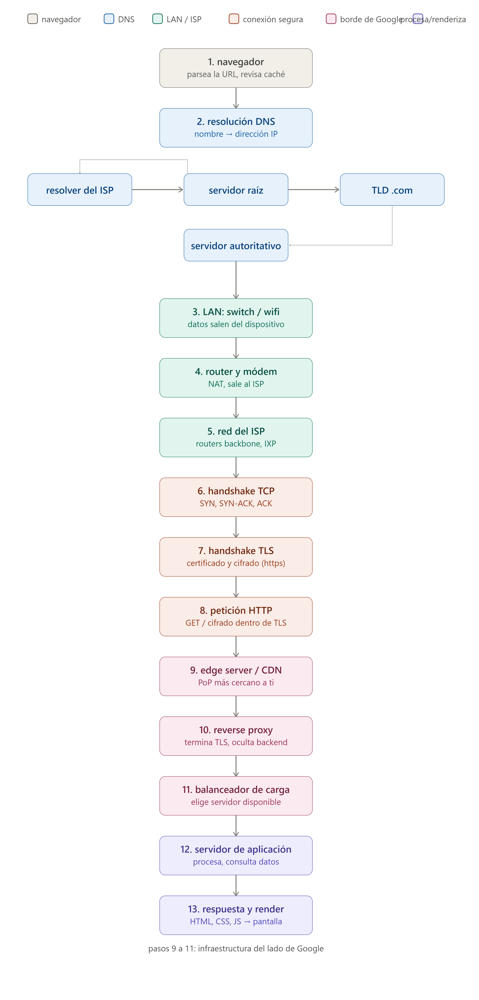

# Fundamentos de Internet 

## 1. Del Cliente al Servidor

Al ingresar la direccion [www.youtube.com](www.youtube.com) en la barra de direcciones y presionar **Enter**, el navegador interpreta el texto ingresado para analizar si es una dirección válida o si es un texto de búsqueda. Posterior a eso, revisa en varios caches del navagador y la computadora, si el sitio ingresado existe, en cuyo caso puede obtener la IP (Internet Protocol) destino. Si no tiene el sitio en cache, procede a realizar una validación de DNS (Domain Name System), en varios niveles, hasta que se obtiene la IP pública que corresponde al sitio ingresado.

Algo muy importante: el computador debe tener acceso a Internet. Para ello, se debe contratar el servicio mediante un ISP (Internet Service Provider), el cual da un módem o enrutador configurado para que brinde conexión de red local entre los dispositivos de la casa u oficina y hacia Internet mediante la asignacion de una dirección IP pública. A partir de este requisito, ya se puede validar el DNS para acceder a las páginas y recursos en Internet.

Una vez que el DNS le retorna la IP destino, el navegador le envía una petición al sistema operativo de la computadora para que establezca una conexión TCP (Transmision Control Protocol) con la IP destino. Ahora, como el explorador asigna por defecto el esquema **https://**, la conexión además se realiza usando TLS (Transport Layer Security) para garantizar que la comunicación sea cifrada.

La comunicación TCP y TLS se realiza usando mecanismo de tipo *handshake*, donde ambas partes, origen y destino, se ponen de acuerdo para iniciar la conexión, transtir los datos y cerrar la conexión.
* TCP: Three-way handshake: SYN -> SYN-ACK -> ACK
* TLS: TLS handshake usando certificado digital firmado por una entidad certificadora.

Cuando se establece la conexión segura se realiza el request HTTP GET al servidor destino. Similar al siguiente ejemplo:

```
GET / HTTP/2
Host: www.youtube.com
User-Agent: ...
Accept: text/html...
```

Cuando la petición llega al destino, el servidor consulta bases de datos, servicios internos, autenticación y otros, y elabora una respuesta que incluya el código HTTP (200 OK si fue exitoso), los encabezados y el cuerpo. En el cuerpo se incluyen elementos como un archivo HTML, código Javascript, estilos CSS, imágenes, vídeos, enlaces, entre otros.

Esa respuesta es enviada por el servidor al navegador usando la conexión TCP/TLS que ya está abierta, y el navegador se encarga de renderizar la página usando los recursos que le fueron retornados.

Es muy importante indicar que el flujo anterior no es tan simple como parece, ya que para que todo esto funcione existen una serie de componentes adicionales que garantizan que los sitios funcionen y puedan ser accedidos de forma segura, protegiendo los recursos del cliente como los del servidor. A continuación se mencionan algunos de estos componentes para dimensionar la complejidad de estas soluciones:
* Balanceador de carga
* CDN (Content Delivery Network)
* Backbone de Internet.
* Datacenters
* Redes
  * LAN (Local Area Network)
  * MAN (Metropolitan Area Network)
  * WAN (Wide Area Network)
* Certificados Digitales y Autoridades Certificadoras.
* Firewalls
* Proxys
  * Forward Proxy
  * Reverse Proxy



## 2. Frontend y Backend en acción

Una aplicación web para agendar citas médicas se confirma del componente visual que permite la interacción del usuario, conocido como **frontend** y unos componentes a los cual es usuario no tiene acceso, pero que son fundamentales para la lógica de negocio y persistencia de datos, conocido como **backend**.

En el frontend se pueden utilizar las siguientes tecnologías: HTML 5 (HyperText Markup Language), JavaScript y sus frameworks, y CSS (Cascading Style Sheets) y sus frameworks. En el backend se pueden utilizar tecnologías para exposición de APIs como Java, .Net, Python, NodeJS, y para almacenamiento de datos como SQL Server, PostgreSQL, MySQL, Oracle,

Usando HTML y algún framework de JavaScript y CSS se presenta una página donde se pueda seleccionar el médico o la especialidad y en un calendario con las horas disponibles para que el usuario seleccione la fecha y hora. Luego, un botón para confirmar la cita y otro para restablecer los valores.

En esta simple presentación del frontend, ocurren muchas interacciones con el backend. Por ejemplo, para cargar la lista de médicos o especialidades, así como llenar el calendario con los horarios ya reservados y los disponibles, además, de la confirmación de la cita. Para ello, el frontend, mediante código JavaScript, realiza requests tipo HTTP GET y POST a los APIs expuestos en el backend, los cuales a su vez, reciben esas peticiones, ejecutan código de lógica de negocio para validar todo lo que sea necesario y, finalmente, consultan o actualizan la base de datos segun corresponda.

Algunos ejemplos consumo de APIs desde el frontend:

Ejemplo 1: Para llenar la lista de médicos activos o disponibles.

Request 

```
GET /doctors?status=available HTTP/1.1
Host: server.my-domain.com
```

Response

```
HTTP/1.1 200 OK
Content-Type: application/json

{
    "doctors": [
        {
            "id": 546465465465,
            "name": "Dr. Juan Pérez",
            "specialty": "Cardiología"
        },
        {
            "id": 378955416549,
            "name": "Dra. María Rojas",
            "specialty": "Pediatría"
        }
    ]
}
```

Ejemplo 2: Cuando el usuario envía la solicitud de cita.

Request

```
POST /appointments HTTP/1.1
Host: server.my-domain.com
Content-Type: application/json

{
    "doctorId": 378955416549,
    "patientId": 6548532,
    "date": "2026-09-20",
    "time": "10:30",
    "reason": "Control de presión arterial"
}
```

El backend recibe este request y de inmediato aplica reglas de negocio como las siguientes:
* El doctor tiene disponibilidad en la fecha y hora indicadas?
* La fecha y hora estén disponibles o ya fue reservada por otro usuario?
* El paciente está activo y con las cuotas de seguro al día?

Si estas reglas se cumplen, se procede a almacenar la cita en la base de datos y retornar 

Response

```
HTTP/1.1 201 Created
Content-Type: application/json
Location: /appointments/9001

{
  "id": 9001,
  "doctorId": 101,
  "patientId": 55,
  "date": "2026-09-20",
  "time": "10:30",
  "reason": "Control de presión arterial",
  "status": "confirmed"
}
```

Si el paciente no está al día con las cuotas, el API retornaría un error indicando que la cita no se logró reservar y el motivo:

```
HTTP/1.1 402 Payment Required
Content-Type: application/json

{
  "error": {
    "code": "INSURANCE_NOT_UP_TO_DATE",
    "message": "El paciente no está al día con las cuotas del seguro. No se puede confirmar la cita.",
    "patientId": 55,
    "outstandingAmount": 45000,
    "currency": "CRC"
  }
}
```

## 3. REST vs SOAP vs GraphQL

Se incluyen dos criterios mas de comparacion: Autorización (acceso a datos no autorizados) y compatibilidad con metodos HTTP.

| Tipo de API | Formato de datos usado | Nivel de flexibilidad | Dificultad de implementación | Uso actual | Autorización | Compatibilidad Métodos HTTP |
|--|--|--|--|--|--|--|
| REST | JSON (también XML) | Media: Definido por elservidor | Baja | Alta | Alta : Control granular por endpoint/recurso | Alta: GET, POST, PUT, PATCH, DELETE |
| SOAP | XML | Baja: Definido por contrato WSDL | Alta | Baja | Alta: Estándares robustos como WS-Security | Baja: solo POST |
| GraphQL | JSON | Alta: El cliente define los datos que requiere | Media | Media | Baja: Un solo endpoint expone todo el esquema - riesgo de mostrar más información | Baja: solo POST |

**¿Cuál considera más apropiada para una startup moderna que desarrolla un sistema de reservas en línea? ¿Por qué?**

REST es el tipo de API más recomendado para el escenario indicado porque está alineado con las tendencias de la industria, es fácil de aprender e implementar y favorece la integración con aplicaciones externas, permitiendo exponer los productos a sistemas globales. El hecho de que sea relativamente restringido por el servidor es una ventaja porque se solicita y retorna los datos estrictamente necesarios para cada operación.

## 4. Explorando APIs con Postman

### 4.1 Selección de la API
- **Nombre de la API:**

DummyJSON

- **Descripción:**

Es una serie de endpoints que permiten probar gratuitamente varias funcionalidades. Para el ejercicio, se usaron los endpoints de Productos.

[DummyJSON - Products](https://dummyjson.com/docs/products)

### 4.2 Configuración en Postman
- **Nombre de la colección:**

DummyJSON

- **Solicitudes agregadas:**

| # | Operación | Método | Endpoint |
|---|---|---|---|
| 1 | Obtener Productos | GET | `/products` |
| 2 | Obtener Producto | GET | `/products/{id}` |
| 3 | Obtener Productos por Categoría | GET | `/products/category/{category}` |
| 4 | Ordenar Productos | GET | `/products?sortBy&order` |
| 5 | Buscar Productos | GET | `/products/search?q` |
| 6 | Paginación | GET | `/products?limit&skip` |
| 7 | Campos específicos | GET | `/products?select` |
| 8 | Filtrar por fecha de modificación | GET | `/products?modifiedAfter` |
| 9 | Agregar Producto | POST | `/products/add` |
| 10 | Actualizar Producto (completo) | PUT | `/products/{id}` |
| 11 | Actualizar Producto (parcial) | PATCH | `/products/{id}` |
| 12 | Eliminar Producto | DELETE | `/products/{id}` |

### 4.3 Ejecución y análisis

| Solicitud | Método | Endpoint | Código de estado | Notas |
|-----------|--------|----------|-------------------|-------|
| Obtener Productos (éxito) | GET | `/products` | 200 OK | Lista completa de productos. Retorna muchas propiedades en cada producto, lo cual está hace más grande el resultado y quizá no sea necesario, pero es el comportamiento esperado, ya que si no se hace así hay crear un endpoint por cada variante de parámetros que se requiere retornar. En cuanto a la paginación, es bueno que retorne 30 registros por defecto.  |
| Obtener Productos (error) | GET | `/producto` | 404 Not Found | Endpoint mal escrito, devuelve página HTML de error |
| Obtener Producto (éxito) | GET | `/products/1` | 200 OK | Detalle del producto con id=1. Retorna muchas propiedades del producto. |
| Obtener Producto (error) | GET | `/products/A` | 404 Not Found | `id` no numérico / inexistente. El error indica que no se valida el tipo de dato de entrada, lo cual es un error ya que el schema de entrada debe validarse antes de pasar la solicitud a las capas inferiores. |
| Obtener Productos by Category (éxito) | GET | `/products/category/smartphones` | 200 OK | Productos de la categoría `smartphones` |
| Obtener Productos by Category (vacío) | GET | `/products/category/A` | 200 OK | Categoría inexistente, devuelve array vacío (no es error). El hecho de que la categoría no exista y aun así se ejecute el query de productos, cuya tabla tiene mas registros, podría traer problemas de rendimiento, sobre todo si la tabla no esta bien indexada. |
| Ordenar Productos (éxito) | GET | `/products?sortBy=title&order=asc` | 200 OK | Orden ascendente por título |
| Ordenar Productos (error) | GET | `/products?sortBy=123&order=123` | 400 Bad Request | `order` inválido, debe ser `asc` o `desc` |
| Buscar Productos (éxito) | GET | `/products/search?q=phone` | 200 OK | Búsqueda por texto `phone` |
| Obtener Productos con Paginación (éxito) | GET | `/products?limit=10&skip=10` | 200 OK | Página de 10 resultados a partir del 11° |
| Obtener Productos con Paginación (vacío) | GET | `/products?limit=10&skip=200` | 200 OK | `skip` supera el total disponible, devuelve array vacío |
| Obtener campos específicos (éxito) | GET | `/products?select=title,price` | 200 OK | Devuelve solo `id`, `title` y `price` |
| Obtener campos específicos (inválido) | GET | `/products?select=A,B` | 200 OK | Campos inexistentes, devuelve solo `id` |
| Filtrar por Fecha Modificación (éxito) | GET | `/products?modifiedAfter=2026-06-01T00:00:00Z&select=title,meta` | 200 OK | Productos modificados después de la fecha indicada |
| Filtrar por Fecha Modificación (vacío) | GET | `/products?modifiedAfter=2027-06-01T00:00:00Z&select=title,meta` | 200 OK | Fecha futura sin coincidencias, devuelve array vacío |
| Agregar Producto (éxito) | POST | `/products/add` | 201 Created | Simula creación; no persiste. Para agregar un registro solo se necesita el nombre, lo cual es extraño porque deja los demás campos vacíos. Asimiendo que hay más campos requeridos, se deberían validar, aunque sea un simulador. |
| Actualización de Producto — PUT (éxito) | PUT | `/products/1` | 200 OK | Simula reemplazo completo; no persiste. A pesar de ser un simulador, debería exigir que se envíen todos los campos requeridos. |
| Actualización de Producto — PUT (error) | PUT | `/products/A` | 404 Not Found | `id` no numérico / inexistente. No se valida el parámetro de entrada antes de hacer la consulta. |
| Actualización Parcial — PATCH (éxito) | PATCH | `/products/1` | 200 OK | Simula actualización parcial; no persiste |
| Actualización Parcial — PATCH (error) | PATCH | `/products/A` | 404 Not Found | `id` no numérico / inexistente. No se valida el parámetro de entrada antes de hacer la consulta. |
| Eliminar Producto (éxito) | DELETE | `/products/1` | 200 OK | Simula eliminación; no persiste |
| Eliminar Producto (error) | DELETE | `/products/A` | 404 Not Found | `id` no numérico / inexistente. No se valida el parámetro de entrada antes de hacer la consulta. |

### 4.4 Explicación técnica

#### [Nombre de la solicitud]
- **Método HTTP:**
- **Endpoint:**
- **Parámetros / body:**
- **Descripción de la respuesta:**

Ver documentación en este archivo [DummyJSON_API_Documentation](resources/DummyJSON_API_Documentation.md)

**¿Qué aprendiste del proceso?**

El uso de parámetros de query para seleccionar los campos que se requiere retornar. Me parece muy útil para reducir el tamaño de la respuesta en aquellos casos que lo ameriten, por ejemplo, para cargar combos.

También aprendí que hay muchos APIs públicos y gratuitos que se pueden utilizar para probar ciertas funcionalidades que estén desarrollando. No necesariamente tengo que desarrollar todo desde cero, si se puede aprovechar lo que otros han hecho y lo comparten a la comunidad.

Conocer la diferencia entre frontend y backend, la interacción entre ambos y la cantidad y complejidad de los componentes que permiten que ambos se comuniquen de forma segura.

### 4.5 Reflexión final

Me ha parecido un contenido muy valioso para enriquecer de forma integral el conocimiento de un desarrollador.